# AWS Hadoop Lab

Lab for deploying and managing a Hadoop cluster on AWS.

## Table of Contents (ToC)

- [Cluster deployment](#cluster-deployment)
- [Cluster management](#cluster-management)
  - [Cluster benchmarking](#cluster-benchmarking)
  - [Backup and TimeLine servers](#backup-and-timeline-servers)
    - [Backup](#backup)
    - [TimeLine](#timeline)
  - [Adding and removing DNNMs](#adding-and-removing-dnnms)
  - [Rack awareness](#rack-awareness)
  - [File System Check (FSCK)](#file-system-check-(fsck))
  - [Erasure Coding (EC)](#erasure-coding-(ec))

## Cluster deployment

**Q: Capturas de pantalla del interfaz web del HDFS y del YARN mostrando que los workers están activos.**

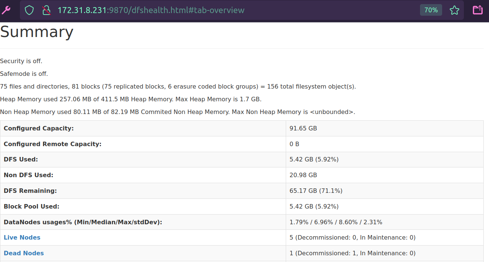

En esta interfaz de Hadoop puede verse en las 2 últimas filas el estado de los DataNodes del clúster. En este caso hay 5 nodos activos y 1 fuera del clúster (decommissioned).

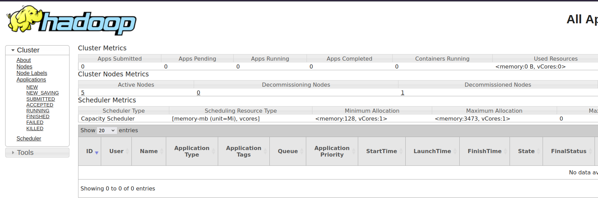

En la interfaz de YARN se muestra la información de estado de los NodeManagers (5 nodos activos y 1 decommissioned). También se muestra información referente al scheduler (ResourceManager), como la memoria y cores mínimos y máximos a reservar para cada contenedor.

**Q: Captura de pantalla del interfaz Web del YARN en la que se muestre que el ejemplo del cálculo de PI ha finalizado con éxito. ¿En qué nodo se ha ejecutado el Application Master? ¿cuántos containers se han reservado?**

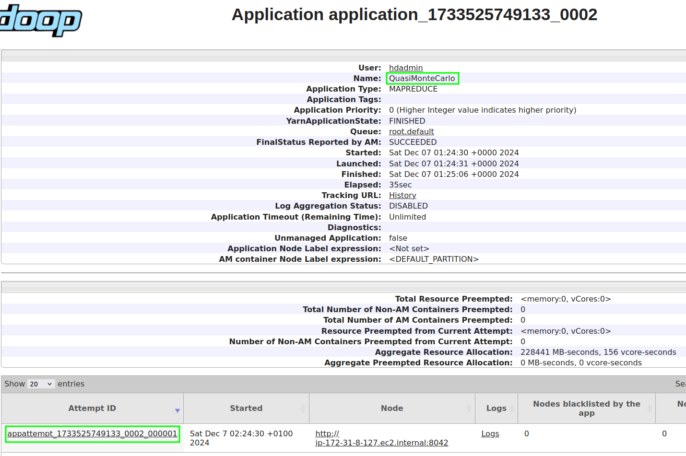

En la interfaz de YARN se muestra información acerca de la ejecución de la aplicación, como el nombre (QuasiMonteCarlo), tipo de aplicación (MapReduce), estado final (succeeded), tiempo transcurrido (35 segundos), entre otra información relevante. En la última tabla se nos muestra el identificador del trabajo e información del tiempo de inicio, el nodo que hizo de ApplicationMaster (uno de los NodeManagers del clúster) y por ende el encargado de la ejecución de la aplicación y los logs.

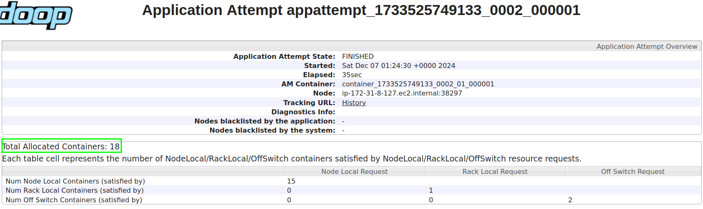

Si pinchamos en el identificador del trabajo podemos ver más información relacionada, como el número total de contenedores reservados (18, se ejecutaron 15), el nodo Application Master (Node), el identificador del contenedor donde corrió el Application Master (AM Container), entre otra información.

**Q: Captura de pantalla de la finalización de la ejecución del WordCount y muestra del contenido de un fichero de salida.**

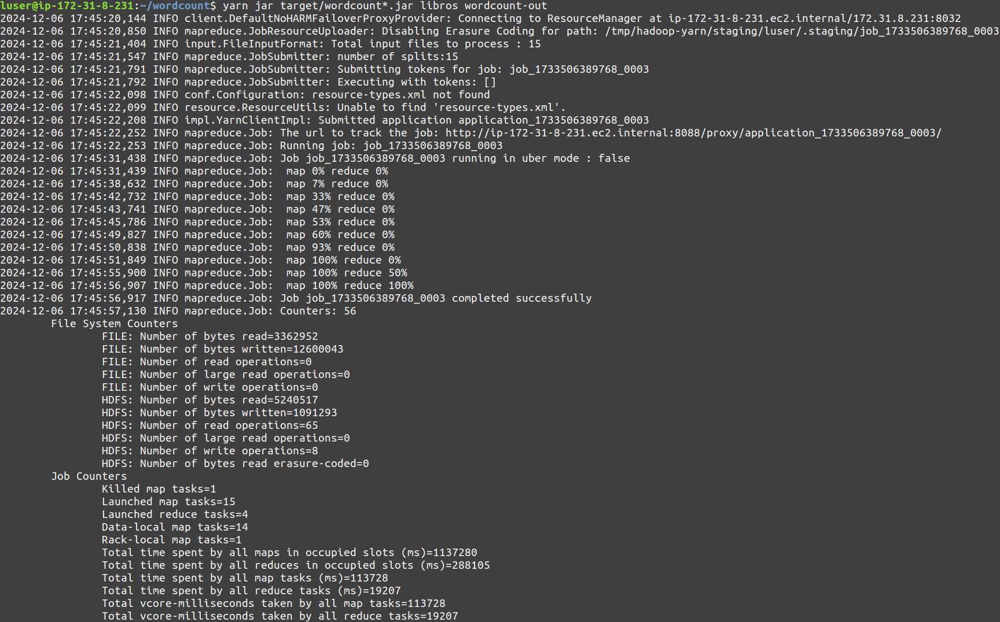

La salida de la aplicación muestra el progreso de las tareas map y reduce. Al momento de terminar satisfactoriamente el trabajo se imprimen las estadísticas del mismo. Se muestran las estadísticas del HDFS y de las tareas MapReduce. Se pueden ver 15 tareas map, que corresponden al total de ficheros dentro del directorio libros y 4 tareas reduce, que se corresponde con el total de DataNodes del clúster.

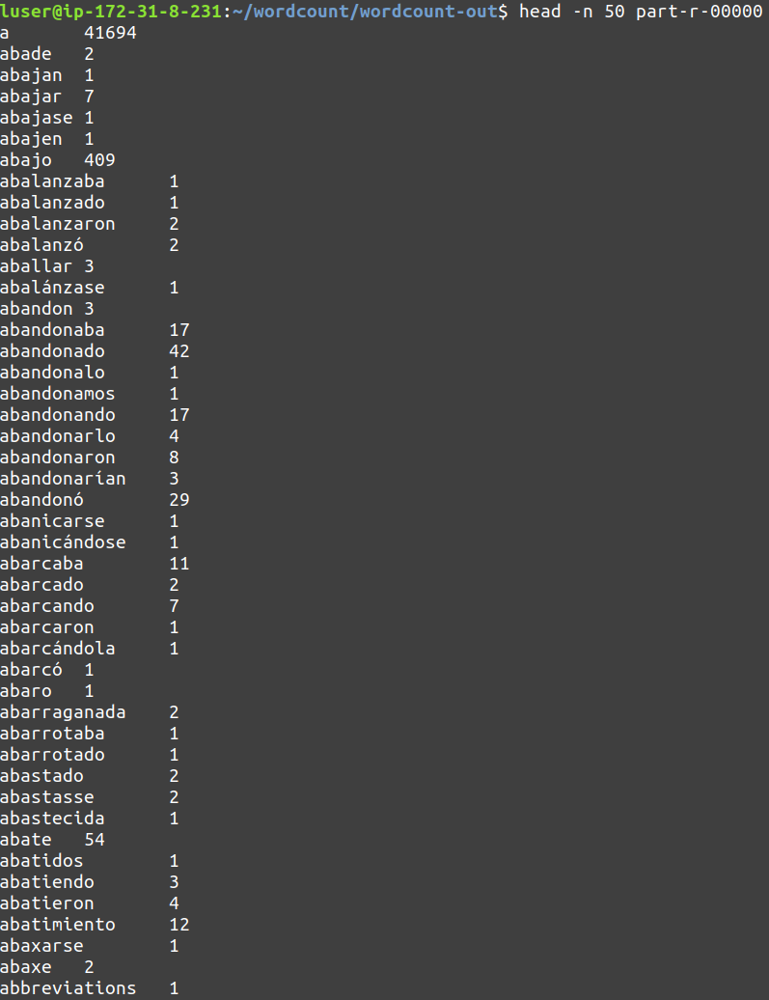

La tarea ha generado 4 ficheros de salida (1 por tarea reduce), cada fichero de salida muestra para cada palabra el número de ocurrencias dentro de los ficheros procesados.

**Q: Responde a las siguientes preguntas:**

- ¿En cuántos bloques se ha dividido el fichero_grande?

- En 16 bloques exactos de 64 MB (en total componen 1 GB), cada bloque posee 3 réplicas.

- Para cada uno de estos bloques ¿en qué DataNodes se encuentran sus réplicas?

Bloque 0:

- ID: 1073741840

- DataNodes:
    - ip-172-31-2-170.ec2.internal

    - ip-172-31-4-60.ec2.internal

    - ip-172-31-7-190.ec2.internal

Bloque 1:

- ID: 1073741841

- DataNodes:

    - ip-172-31-4-60.ec2.internal

    - ip-172-31-14-201.ec2.internal

    - ip-172-31-7-190.ec2.internal

Bloque 2:

- ID: 1073741842

- DataNodes:

    - ip-172-31-14-201.ec2.internal

    - ip-172-31-4-60.ec2.internal

    - ip-172-31-7-190.ec2.internal

Bloque 3:

- ID: 1073741843

- DataNodes:

    - ip-172-31-14-201.ec2.internal
    
    - ip-172-31-4-60.ec2.internal
    
    - ip-172-31-7-190.ec2.internal

Bloque 4:

- ID: 1073741844

- DataNodes:

    - ip-172-31-14-201.ec2.internal

    - ip-172-31-4-60.ec2.internal

    - ip-172-31-7-190.ec2.internal

Bloque 5:

- ID: 1073741845

- DataNodes:

    - ip-172-31-14-201.ec2.internal

    - ip-172-31-4-60.ec2.internal

    - ip-172-31-7-190.ec2.internal

Bloque 6:

- ID: 1073741846

- DataNodes:

    - ip-172-31-14-201.ec2.internal

    - ip-172-31-4-60.ec2.internal

    - ip-172-31-7-190.ec2.internal

Bloque 7:

- ID: 1073741847

- DataNodes:

    - ip-172-31-2-170.ec2.internal

    - ip-172-31-4-60.ec2.internal

    - ip-172-31-14-201.ec2.internal

Bloque 8:

- ID: 1073741848

- DataNodes:

    - ip-172-31-2-170.ec2.internal

    - ip-172-31-4-60.ec2.internal

    - ip-172-31-7-190.ec2.internal

Bloque 9:

- ID: 1073741849

- DataNodes:

    - ip-172-31-2-170.ec2.internal

    - ip-172-31-4-60.ec2.internal

    - ip-172-31-7-190.ec2.internal

Bloque 10:

- ID: 1073741850

- DataNodes:

    - ip-172-31-2-170.ec2.internal

    - ip-172-31-4-60.ec2.internal

    - ip-172-31-14-201.ec2.internal

Bloque 11:

- ID: 1073741851

- DataNodes:

    - ip-172-31-2-170.ec2.internal

    - ip-172-31-4-60.ec2.internal

    - ip-172-31-14-201.ec2.internal

Bloque 12:

- ID: 1073741852

- DataNodes:

    - ip-172-31-14-201.ec2.internal

    - ip-172-31-4-60.ec2.internal

    - ip-172-31-7-190.ec2.internal

Bloque 13:

- ID: 1073741853

- DataNodes:

    - ip-172-31-2-170.ec2.internal

    - ip-172-31-4-60.ec2.internal

    - ip-172-31-7-190.ec2.internal

Bloque 14:

- ID: 1073741854

- DataNodes:

    - ip-172-31-14-201.ec2.internal

    - ip-172-31-4-60.ec2.internal

    - ip-172-31-7-190.ec2.internal

Bloque 15:

- ID: 1073741855

- DataNodes:

    - ip-172-31-14-201.ec2.internal

    - ip-172-31-4-60.ec2.internal

    - ip-172-31-7-190.ec2.internal

Como se puede apreciar, el almacenamiento de las réplicas se va alternando entre los 4 DataNodes del clúster.

## Cluster management

### Cluster benchmarking

**Q: Ejecutar los benchmarks propuestos. Para el documento de entrega, obtener capturas de pantalla de las salidas de estas ejecuciones.**

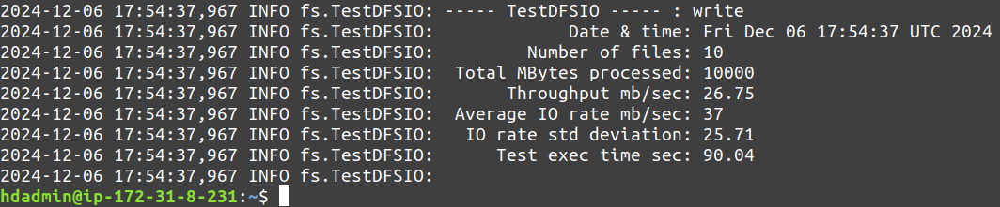

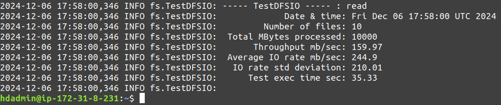

Terasort

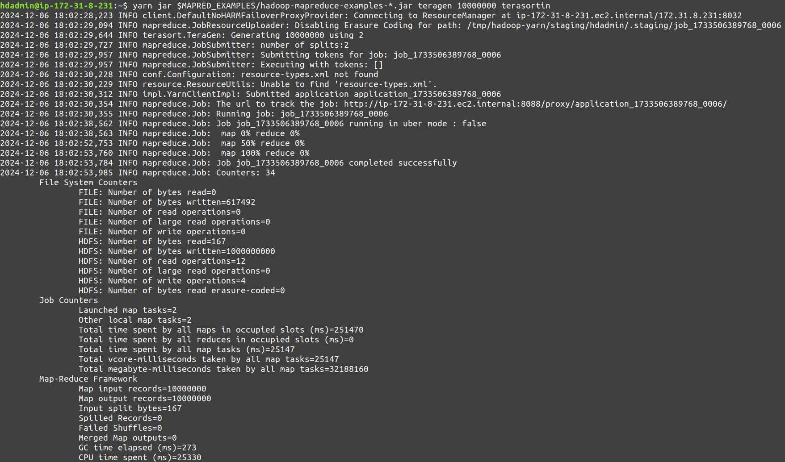

En esta fase se generan 1 GB de datos aleatorios.

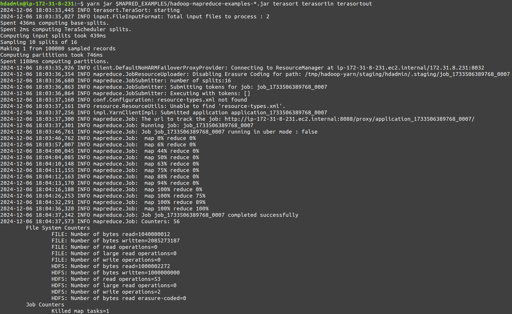

Esta fase ordena los datos propiamente.

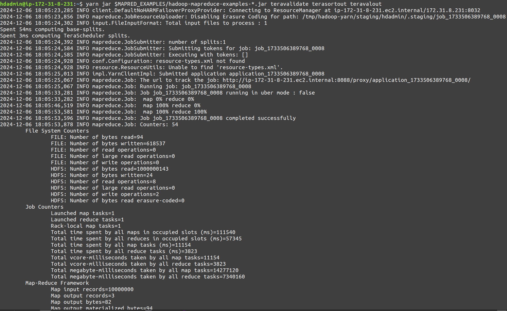

Por último, teravalidate verifica la correcta ordenación de los datos.

**Q: ¿Cuánto valen el Throughput y el Average IO rate de escritura? ¿y los de lectura? ¿Cuáles son más grandes y por qué?**

Escritura:

- Throughput: 26.75 mb/sec

- Average IO rate: 37 mb/sec

Lectura:

- Throughput: 159.97 mb/sec

- Average IO rate: 244.9 mb/sec

Tanto el throughput como el IO dan mejores resultados al realizar operaciones de lectura que de escritura. Esto puede deberse al comportamiento del HDFS, ya que al escribir un bloque, los datos deben replicarse x3, por lo que se añade un tiempo extra de copia de los datos y transmisión por la red de esos datos a otros nodos del clúster. Mientras que para una lectura sólo es necesario leer una de las réplicas del bloque (HDFS a conciencia optimizará el acceso a esos datos leyendo el bloque del nodo más cercano, seguramente teniendo en cuenta la distribución de los nodos en los racks). También HDFS debe asegurar la persistencia de los datos, por lo que las escrituras deben de reflejarse en el disco local del worker al finalizar la tarea Map. Posteriormente, el worker que ejecuta la tarea Reduce lee los datos del disco local del worker que ejecutó dicha tarea Map y finalmente se guarda el resultado en el DFS. Todos estos pasos son omitidos por las operaciones de lectura.

**Q: En el interfaz web de YARN, mira la aplicación Terasort una vez que haya terminado y haz una captura de pantalla de la información de la ejecución. ¿Cuánto vale el Elapsed Time?**

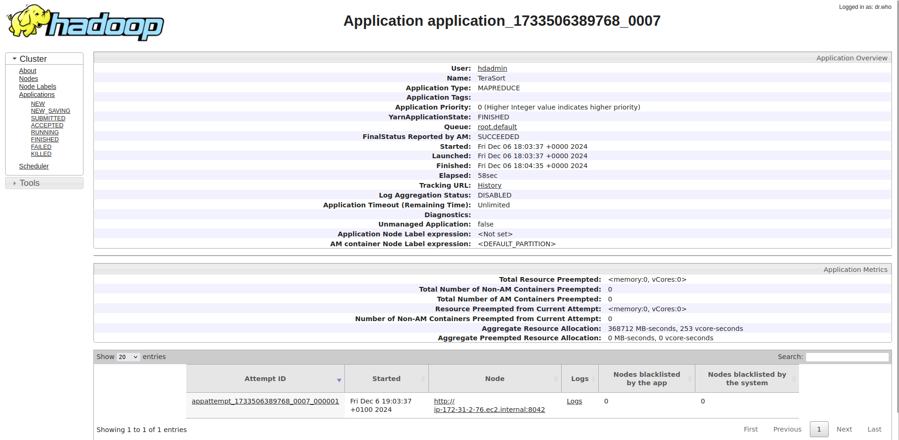

Elapsed time: 58 segundos.

### Backup and TimeLine servers

#### Backup

**Q: Captura de pantalla en la que se vean los mensajes que genera el servicio de backup, destacando aquellos en los que se vea como se hace el checkpoint**

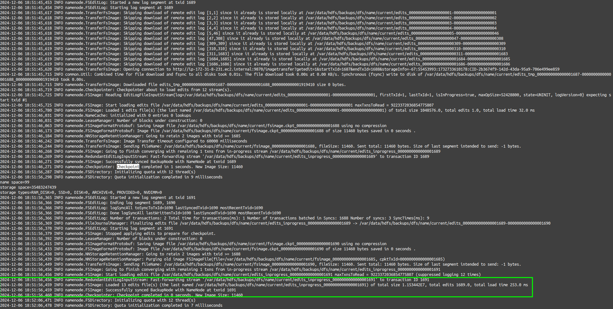

En esta salida de log se muestran todos los pasos que el BackupNode sigue para realizar el checkpoint. El nodo toma el fichero edits y fsimage de su memoria (ya que está actualizada respecto al NameNode) y aplica los cambios al fsimage actual para crear el nuevo fsimage. Finalmente se crea un nuevo edits_inprogress y se realiza una sincronización de la memoria con el NameNode.

**Q: Captura de pantalla en la que se compare el contenido del directorio del backup con el directorio con los metadatos de NameNode, antes y una vez que el servicio de backup se ha completado.**

Antes del backup:

- NNRM:

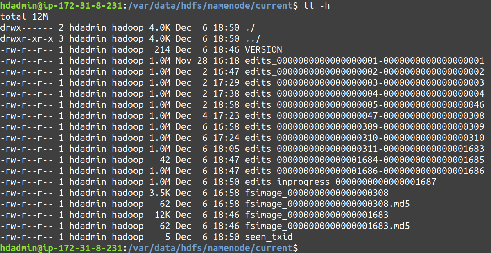

- BKTL:

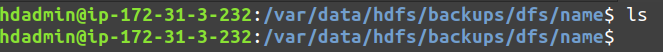

Después del backup:

- NNRM:

Ahora se muestra una gran cantidad de ficheros edits en el directorio del NameNode,en total los que ya residían en el directorio del NameNode y 1 por cada checkpoint (lo dejé ejecutando varios minutos). Como configuramos el checkpointing cada 10 segundos, los ficheros edits son pequeños y contienen información de 1 única transacción. El resultado es un nuevo fichero edits_inprogress empezando en la transacción siguiente a la última del último fichero edits (1777) y un fsimage en la transacción 1776 (que debería de aparecer). Esto prueba que en cada checkpoint se genera un fsimage con los últimos cambios actualizados.

- BKTL:

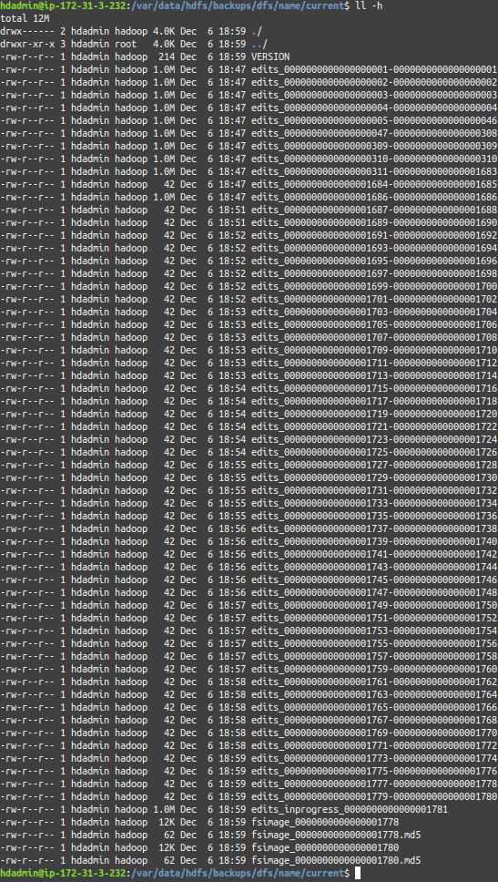

El nodo BKTL posee los mismos ficheros edits que el nodo NNRM (por la sincronización de la memoria) excepto algunos ficheros edits extra que no tiene el NameNode. Es un hecho curioso, ya que el BKTL realiza los checkpoints en base a los ficheros edits que el NameNode le proporciona.

**Q: Captura de pantalla en la que se compare el contenido del directorio de metadatos del NameNode antes y después de hacer el checkpoint. Explica qué ha sucedido.**

Antes de hacer checkpointing:

Después de hacer checkpointing:

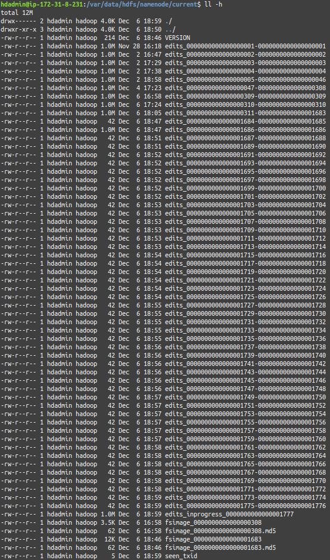

Vemos nuevos ficheros edits resultado de cada checkpoint realizado. Nuevamente, no aparece el fsimage correspondiente a la última transacción del último edits (1776).

**Q: Captura de pantalla del interfaz web del nodo de backup**

Interfaz web:

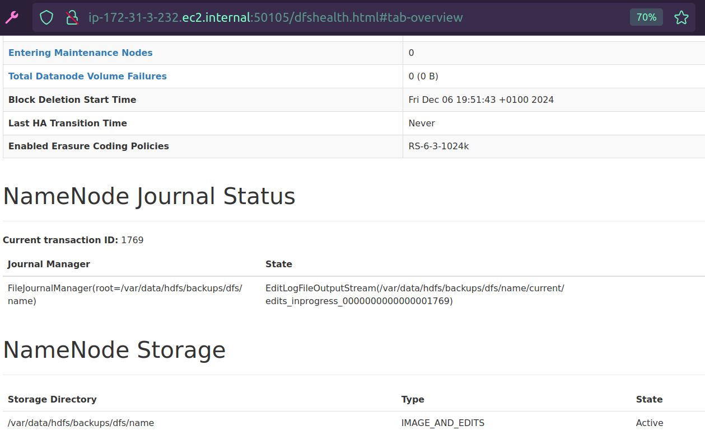

En esta pantalla puede verse información del ID de la transacción actual, así como información relacionada con la ruta de almacenamiento en el BackupNode de los ficheros fsimage y edits (IMAGE_AND_EDITS) y su estado (activo).

#### TimeLine

**Q: Captura de pantalla del interfaz web del TimeLineServer en la que se vea que se ha recogido la información de la ejecución de una o más tareas.**

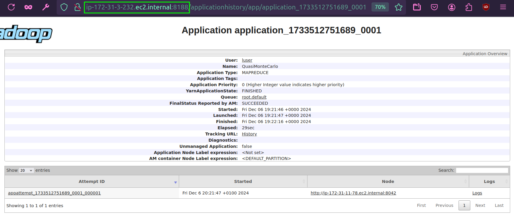

En este caso se muestra la información relacionada para la aplicación de pi (QuasiMonteCarlo).

### Adding and removing DNNMs

**Q: La salida de los comandos hdfs dfsadmin -report y yarn node -list que muestren que el nodo está retirado**

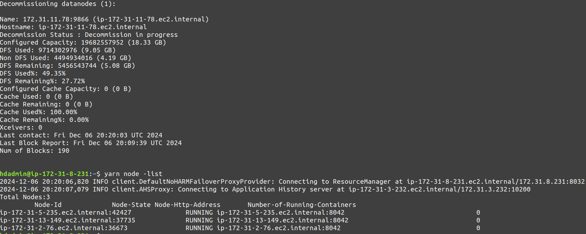

En el hdfs se muestra que el nodo está retirado del servicio (Decommissioned). En yarn el nodo desaparece de la lista de nodos activos.

**Q: Mira lo que ha pasado con los bloques del fichero grande ¿alguno de los bloques tenía una réplica en el DDNM que hemos retirado? ¿dónde se encuentra ahora?**

Los bloques del fichero grande que se encontraban en el nodo retirado ya no se cuentan como réplica, por lo que se han creado nuevas réplicas de esos bloques y se han movido a los nodos que no tenía ninguna réplica del bloque en cuestión.

**Q: Salida de los comandos hdfs dfsadmin -report y yarn node -list que muestren los nuevos DNNMs activos.**

> [!NOTE]
> Se ha realizado una nueva ejecución con nuevos nodos

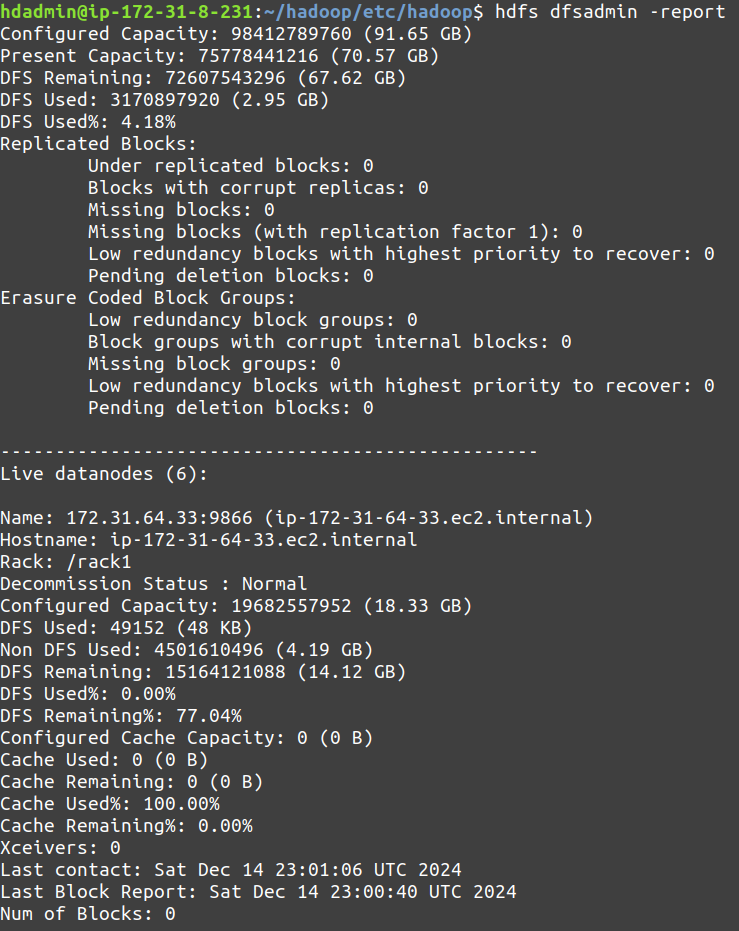

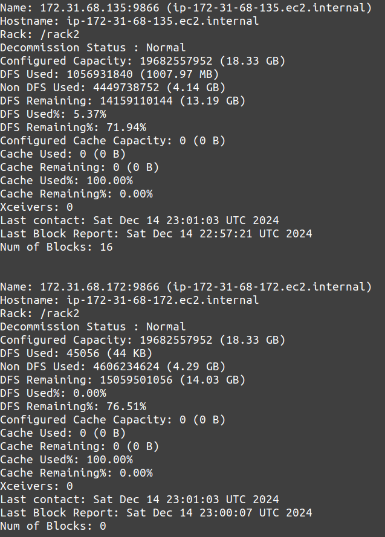

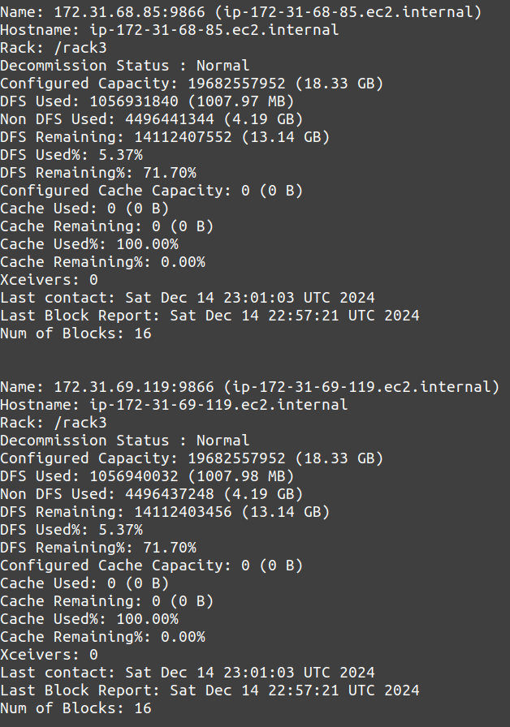

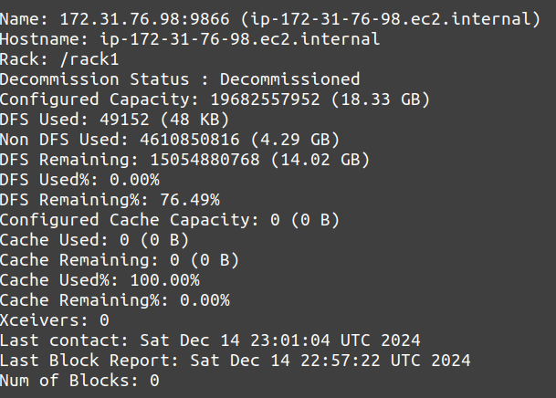

En hdfs a pesar de haber retirado un nodo, este sigue figurando como vivo (pero en estado decommissioned). Podemos apreciar en la última captura los 2 nuevos nodos agregados, en estos de momento tienen sus discos locales vacíos esperando datos del hdfs.

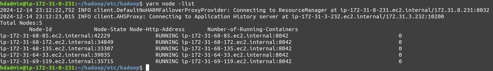

En yarn el nodo retirado no se muestra en la lista de nodos activos.

**Q: Salida de la ejecución del balanceador de carga**

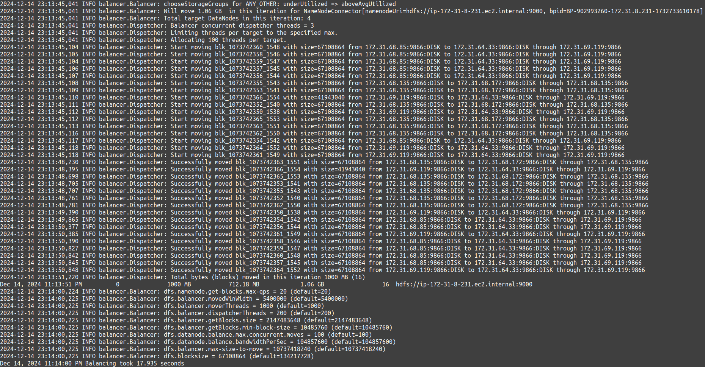

Podemos ver múltiples mensajes de INFO que detallan el movimiento de los bloques de los nodos “antiguos” a los 2 nodos nuevos. Finalmente se muestra el total de bytes y bloques movidos, así como el tiempo de ejecución de la operación de balanceo.

**Q: Información sobre el espacio, en bytes y en bloques que tienen ocupados los dos nuevos DNNMs. ¿Algún bloque del fichero grande se ha movido a estos nuevos nodos?**

Espacio antes del balanceo para ambos nodos:

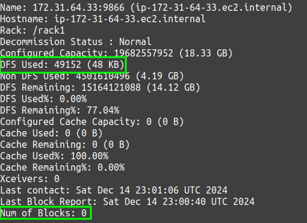

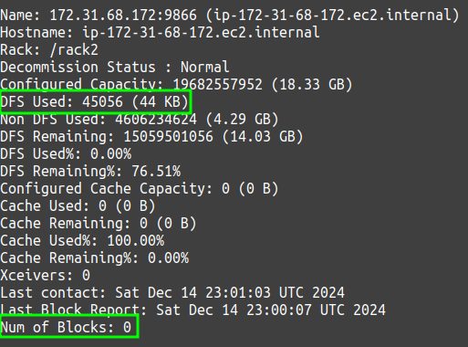

Espacio después del balanceo:

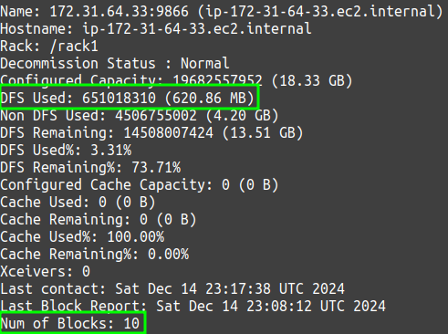

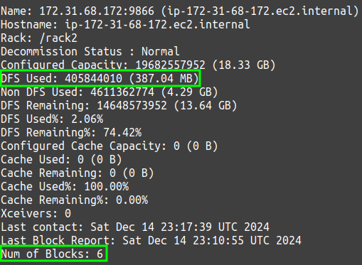

Algunos bloques del fichero grande que residían en nodos más ocupados en cuanto a espacio se han movido a estos nuevos nodos.

### Rack awareness

**Q: Muestra la salida del comando hdfs dfsadmin -printTopology con la distribución por racks**

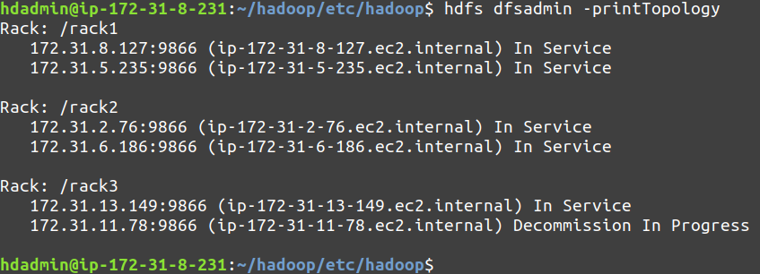

Se muestra como los 6 DataNodes se han distribuido en 3 racks.

### File System Check (FSCK)

**Q: Una captura de pantalla en la que se vea el estado inicial del HDFS (salida del comando hdfs fsck)**

Hasta este punto el DFS se encuentra estable en cuanto a bloques replicados e integridad de los mismos se refiere.

**Q: Una captura de pantalla con la salida del comando hdfs dfsadmin -report en la que se vea que solo quedan dos DNNM activos así como el número de bloques que tiene cada uno.**

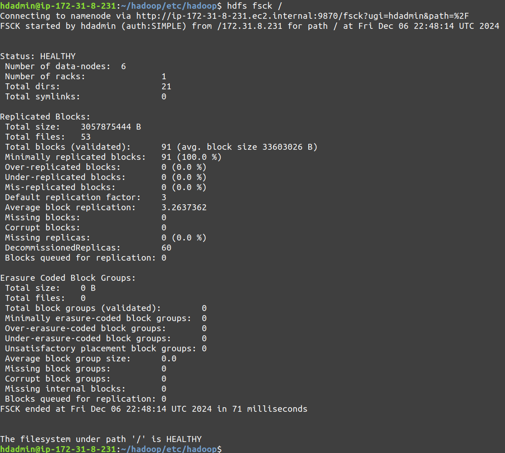

Se puede observar en la captura que quedan 2 nodos activos, con 22 y 37 bloques respectivamente, cantidad inferior a la que había inicialmente (91 bloques).

**Q: Una captura de pantalla en la que se vea el estado del HDFS después de retirar los nodos**

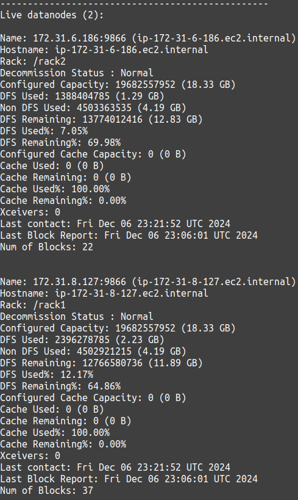

**Q: ¿Cuántos bloques aparecen under-replicated?**

22 bloques tienen menos de 3 réplicas.

**Q: ¿Aparecen bloques perdidos y ficheros corruptos? En el caso de que haya bloques perdidos, indica a qué fichero/s corresponden.**

hdfs fsck -list-corruptfileblocks

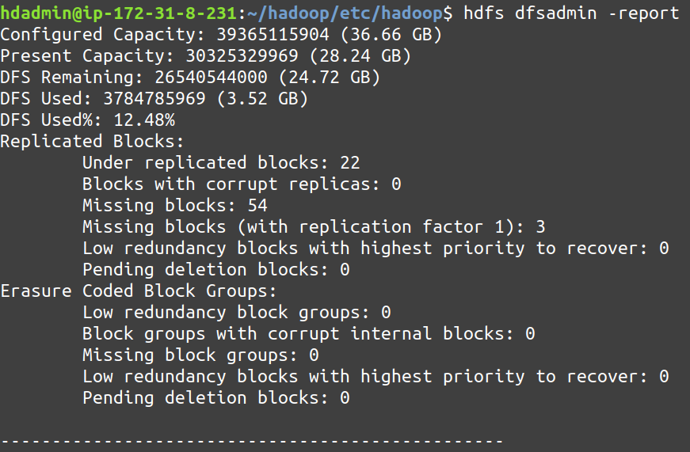

En total hay 54 bloques corruptos y 3 bloques con factor de replicación 1 perdidos, lo que quiere decir que se ha perdido parte de la información de 1 a máximo 3 ficheros, por lo que esos ficheros están corruptos.

**Q: ¿Cuál es el número de réplicas y la localización de los bloques del fichero_grande? ¿Es posible recuperar el fichero?**

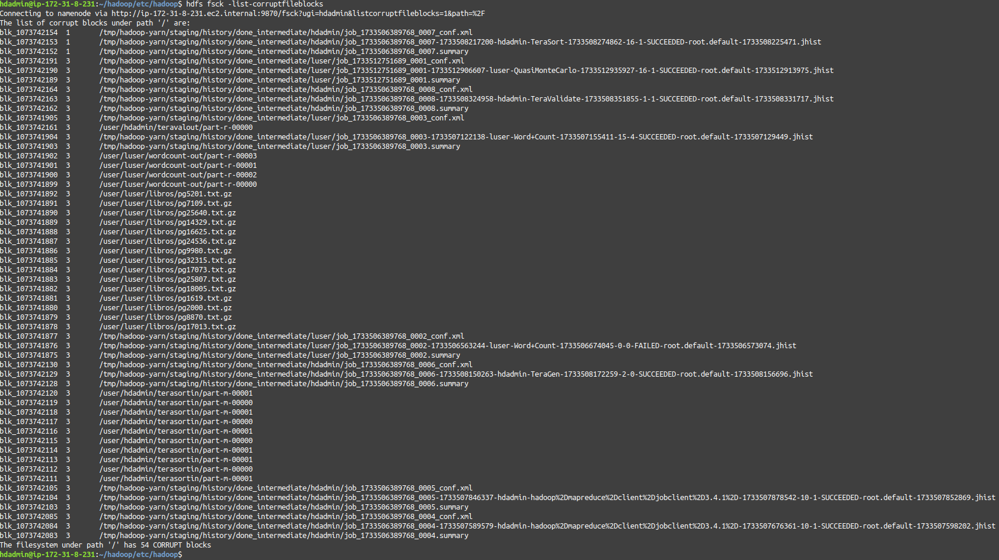

Los 16 bloques de fichero_grande poseen 2 réplicas en los 2 DataNodes vivos del clúster, si consultamos el estado del archivo con hdfs fsck, nos dice que el fichero se encuentra healthy (no está corrupto).

**Q: Una vez añadido el nuevo DNNM y después de un cierto tiempo ¿Con cuántos bloques se queda el nuevo DNNM? ¿se ha recuperado el factor de replicación medio?**

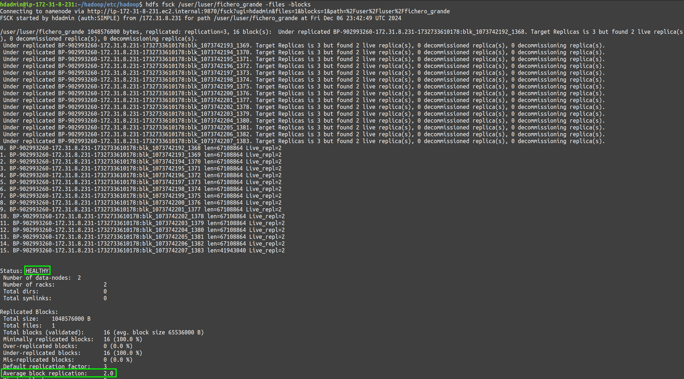

El nuevo DNNM posee 16 bloques. El factor de replicación promedio ha vuelto a 3 y ahora ningún bloque se encuentra underreplicated.

### Erasure Coding (EC)

**Q: Una captura de pantalla que muestre el espacio ocupado antes de mover el fichero.**

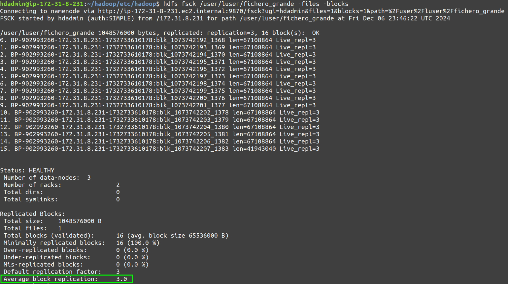

**Q: Una captura de pantalla que muestre el espacio ocupado después de mover el fichero al directorio /user/grandes.**

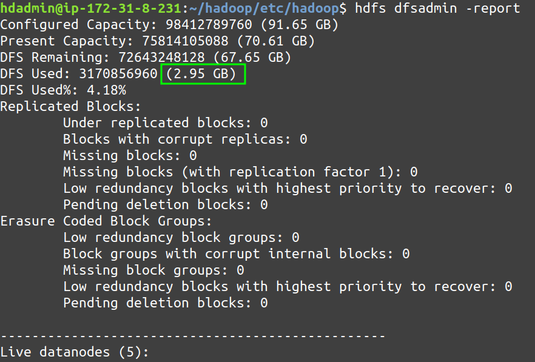

Se ha conseguido reducir el espacio en DFS aplicando esta política de EC en más de 1 GB.

**Q: Lista de bloques que tiene ahora el fichero_grande y los datanodes en los que se sitúan.**

El fichero está compuesto por 6 bloques con factor de réplica 1. Los 5 DataNodes vivos poseen cada bloque del fichero_grande (5*6=30 bloques en total).

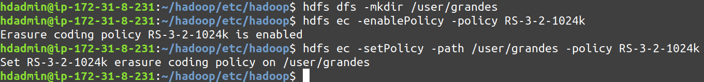

**Q: ¿A qué se debe esta distribución? ¿cómo funciona la política RS-3-2-1024k?**

Las políticas de EC siguen la estructura codec (RS, Reed-Solomon)-num data blocks (3) -num parity blocks (2) -cell size (1024 KB, tamaño del stripe de datos). RS-3-2-1024k quiere decir que se aplica Reed-Solomon para añadir paridad, con 3 bloques de datos, 2 bloques de paridad y stripe de 1024 KB que usará el RS para el encoding.

El fichero grande pesa 1 GB y se divide en 16 bloques de 64 MB. En este caso cada nodo almacena 1 bloque de datos o 1 bloque de paridad, si tenemos 5 nodos en total 3 nodos tienen los 3 bloques de datos y los otros 2 nodos guardan los 2 bloques de paridad, esto se debe al funcionamiento de la política, que por cada bloque de fichero_grande genera 3 bloques de datos (de tamaño 64 MB cada uno) y 2 de paridad. Esto conforma 1 bloque del fichero_grande, en total existen 6 (16/(3 bloques de datos)) = 5.3 bloques.